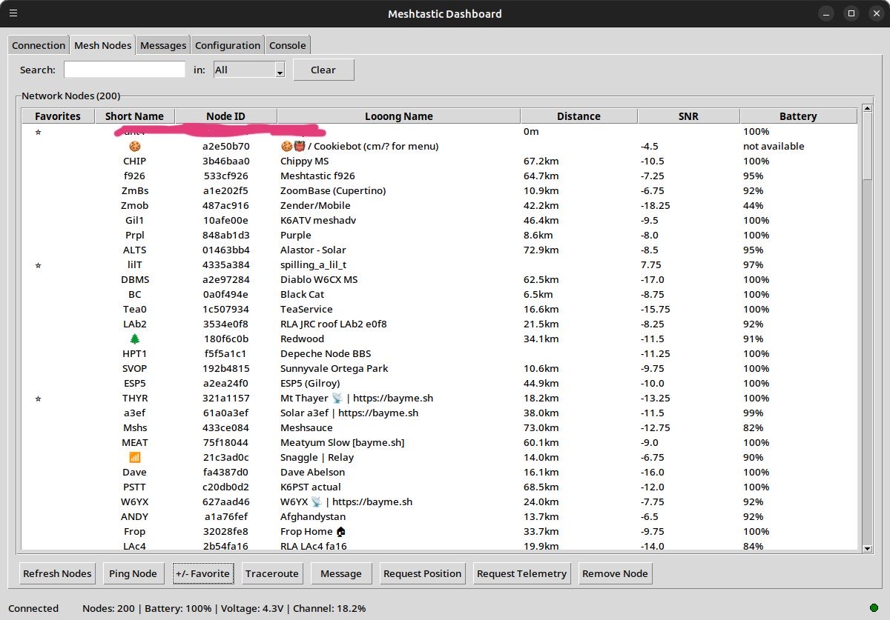
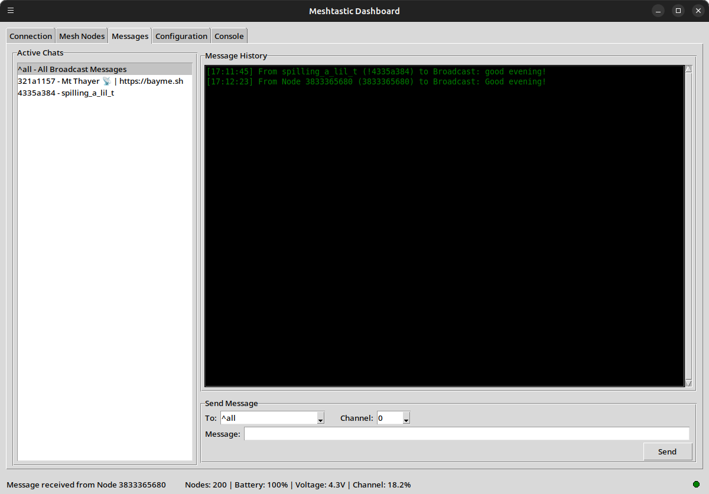

# Meshtastic GUI

A user-friendly graphical interface for Meshtastic devices built with tkinter.

## Overview

Meshtastic GUI provides an intuitive desktop application for interacting with Meshtastic mesh networking devices. It offers a comprehensive interface for device management, node visualization, messaging, and configuration.

## Features

- **Device Connection**: Connect via Serial (USB), TCP/IP, or Bluetooth LE
- **Mesh Network Visualization**: View all nodes in your mesh network with real-time updates
- **Messaging**: Send and receive text messages with full conversation history
- **Node Management**: 
  - Favorite nodes for quick access
  - Request position and telemetry data
  - Perform network traceroutes
  - Ping nodes to test connectivity
- **Configuration**: Manage device and channel settings
- **Monitoring**: Real-time packet monitoring and logging
- **Data Export**: Export conversations, node data, and packet logs

## Screenshots


*Main interface showing the device connection and mesh network overview*



*Mesh nodes tab displaying all discovered nodes in the network*



*Messaging interface for sending and receiving text messages*


*Monitor tab showing real-time packet data and activity*


*Configuration panel for device and channel management*

## Installation

### Prerequisites

- **Python 3.8 or higher** - Download from [python.org](https://python.org)
- **Git** (optional) - For cloning the repository

### Quick Start

#### Option 1: Automated Installation (Recommended)

The easiest way to install Meshtastic GUI is using the provided installation scripts that set up a Python virtual environment:

**Linux/macOS:**
```bash
# Download/clone the repository
git clone <repository-url>
cd meshtastic-gui

# Run the installation script
chmod +x install.sh
./install.sh

# Launch the GUI
./run.sh
```

**Windows:**
```cmd
REM Download/clone the repository
git clone <repository-url>
cd meshtastic-gui

REM Run the installation script
install.bat

REM Launch the GUI  
run.bat
```

#### Option 2: Manual Installation

If you want more control over the installation process:

```bash
# 1. Create virtual environment
python3 -m venv venv

# 2. Activate virtual environment
# Linux/macOS:
source venv/bin/activate
# Windows:
venv\Scripts\activate

# 3. Upgrade pip
python -m pip install --upgrade pip

# 4. Install dependencies
pip install -r requirements.txt

# 5. Install GUI in development mode
pip install -e .

# 6. Launch GUI
meshtastic-gui
```

### What the Installation Does

The installation process:

1. **Creates a virtual environment** in the `venv/` directory
2. **Installs Python dependencies**:
   - `meshtastic` - The core Meshtastic Python library
   - `pypubsub` - For event handling
3. **Installs the GUI application** in development mode
4. **Creates launcher scripts** for easy execution

### Virtual Environment Benefits

Using a virtual environment provides:

- **Isolation** - Prevents conflicts with other Python packages
- **Reproducibility** - Ensures consistent dependency versions
- **Cleanliness** - Keeps your system Python installation clean
- **Easy removal** - Just delete the `venv/` folder to uninstall

## Usage

### Daily Usage

After initial installation, you can launch the GUI using:

```bash
# Quick launch (Linux/macOS)
./run.sh

# Quick launch (Windows)  
run.bat

# Or manually activate environment first
source venv/bin/activate  # Linux/macOS
venv\Scripts\activate     # Windows
meshtastic-gui
```

### Getting Started

1. **Connect to Device**:
   - Use the Connection tab to select your connection method
   - For USB: Select your serial port
   - For TCP: Enter IP address and port
   - For BLE: Choose from discovered devices

2. **View Network**:
   - The Mesh Nodes tab shows all discovered nodes
   - Favorite important nodes using the star column
   - Double-click nodes for quick actions

3. **Send Messages**:
   - Use the Messages tab to communicate
   - Select recipients from the dropdown
   - View conversation history in the active chats

4. **Monitor Activity**:
   - The Monitor tab shows real-time packet data
   - Export logs for analysis
   - Use CLI commands for advanced operations

## Requirements

- Python 3.8 or higher
- Meshtastic CLI library (automatically installed as dependency)
- tkinter (usually included with Python)
- Operating System: Windows, macOS, or Linux

## Device Compatibility

Compatible with all Meshtastic-supported devices:
- ESP32-based devices
- nRF52-based devices
- Native NRF52 devices
- And more...

Supports all connection methods:
- USB/Serial
- WiFi (TCP)
- Bluetooth Low Energy

## Troubleshooting

### Python Not Found
```bash
# Make sure Python 3.8+ is installed
python3 --version
```

### Permission Issues (Linux/macOS)
```bash
# Make scripts executable
chmod +x install.sh run.sh
```

### Virtual Environment Issues
```bash
# Remove and recreate virtual environment
rm -rf venv
python3 -m venv venv
```

### Import Errors
The GUI depends on the `meshtastic` library. If you get import errors:

1. Make sure the virtual environment is activated
2. Reinstall dependencies: `pip install -r requirements.txt`
3. Check that the meshtastic library installed correctly: `pip list | grep meshtastic`

### GUI Won't Start
1. Check that you're in the virtual environment
2. Verify installation: `which meshtastic-gui` (should show path in venv)
3. Run test script: `python test_install.py`

## Uninstalling

To completely remove the GUI:

```bash
# Remove virtual environment
rm -rf venv

# Remove generated files
rm -f activate.sh activate.bat

# The source code and scripts remain for future use
```

## Development

For development work:

```bash
# Clone the repository
git clone <repository-url>
cd meshtastic-gui

# Set up virtual environment using install script
./install.sh  # Linux/macOS
# or
install.bat   # Windows

# Install development dependencies
source venv/bin/activate  # Linux/macOS
# or
venv\Scripts\activate     # Windows

pip install -e .[dev]

# Run tests
python test_install.py

# Make changes to src/meshtastic_gui/gui.py
# Changes are immediately available without reinstalling
```

## Contributing

Contributions are welcome! Please feel free to submit pull requests, report bugs, or suggest features.

## License

This project is licensed under the GPL-3.0 License - see the LICENSE file for details.

## Support

- [Meshtastic Documentation](https://meshtastic.org/)
- [Community Discord](https://discord.gg/meshtastic)
- [GitHub Issues](https://github.com/meshtastic/gui/issues)

## Acknowledgments

Built on top of the excellent [Meshtastic Python library](https://github.com/meshtastic/python).